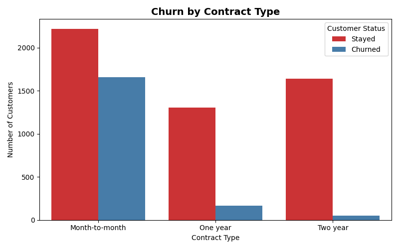
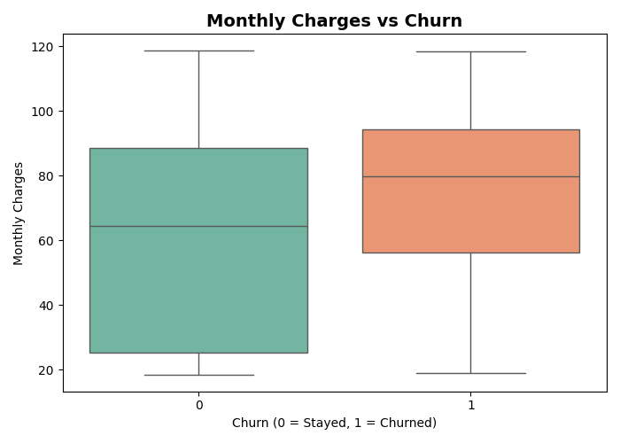
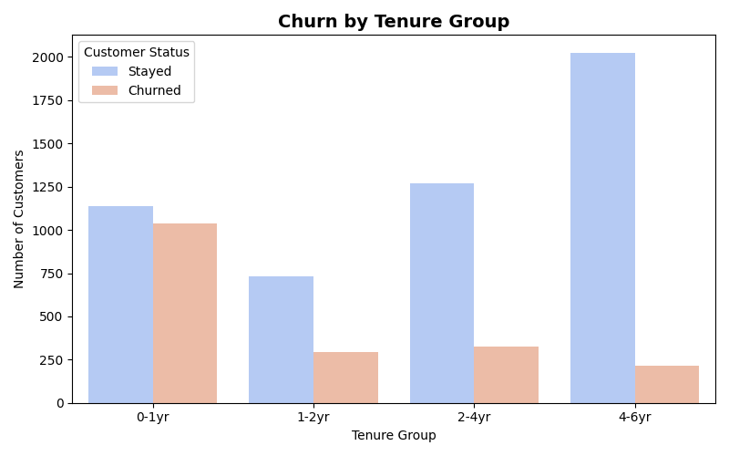
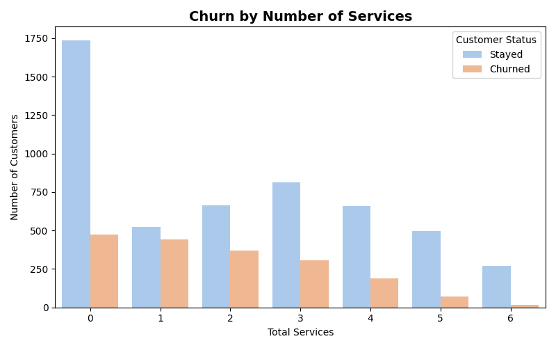
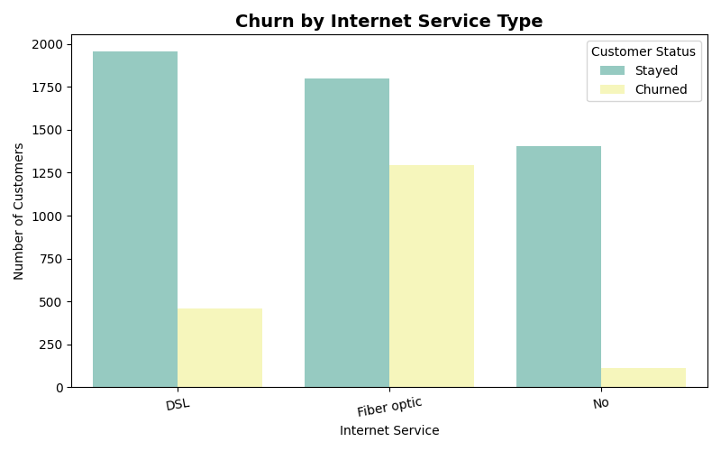

# Customer Churn Analysis

## Project Overview
This project analyzes customer churn behavior in a telecom company using Python. The objective is to identify key factors influencing customer churn and provide actionable insights to improve customer retention.

---

## Tools and Technologies
- Python (Pandas, NumPy)
- Data Visualization (Matplotlib, Seaborn)
- Jupyter Notebook / Google Colab

---

## Key Insights

### Contract Type Impact
Customers with month-to-month contracts have the highest churn rate, while long-term contracts significantly improve retention.

### Pricing Impact
Customers with higher monthly charges are more likely to churn, indicating pricing sensitivity.

### Customer Lifecycle
New customers (0–1 year tenure) show the highest churn rate, while long-term customers are more stable and loyal.

### Service Engagement
Customers using more services tend to churn less, suggesting that higher engagement improves retention.

### Internet Service
Customers using fiber optic internet exhibit higher churn compared to DSL users.

---

## Visualizations

### Contract vs Churn

### Monthly Charges vs Churn

### Tenure vs Churn

### Services vs Churn

### Internet Service vs Churn

---

## Conclusion
Customer churn is primarily influenced by contract type, pricing, service engagement, and customer lifecycle stage. Improving early customer experience, encouraging long-term contracts, and increasing service adoption can help reduce churn.

---

## Future Improvements
- Build a machine learning model to predict churn
- Create an interactive dashboard using Power BI
- Perform advanced feature engineering
